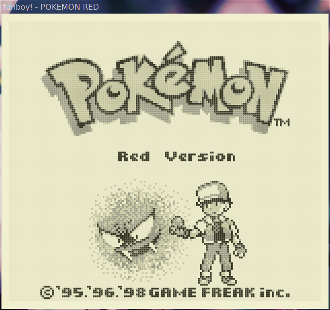

# funboy

this is a gameboy emulator which currently only emulates the original gameboy.

it is designed to be relatively simple while also making efficient use of cpu time,
allowing it to run on low-end processors - think low double digit MHz.

this emulator is imperfect. the cpu and timing emulation is relatively accurate, but
the ppu emulation needs much work, and sound emulation is currently missing entirely.

# building

## unix-like systems:

install `meson` and `ninja`, then run:

    meson build
    cd build
    ninja

## classic mac os:

on a unix-like system, first install `cmake` and build a working [Retro68](https://github.com/autc04/Retro68) toolchain, and set the environment variable RETRO68_BUILD to its location. then, run the following:

    mkdir build-mac
    cmake -DCMAKE_TOOLCHAIN_FILE=$RETRO68_BUILD/toolchain/m68k-apple-macos/cmake/retro68.toolchain.cmake ..
    make

it can also be built natively using CodeWarrior, but project files are currently not included. this is only tested occasionally, and only with CodeWarrior 10.